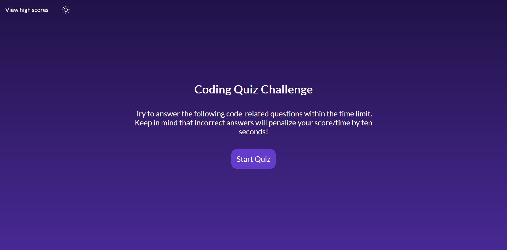

# Quiz App

## Description
This is a simple quiz app using JavaScript, HTML and CSS.  
 The time is your score, incorrect answers subtract 10 seconds. Your results are displayed at the end and are saved to local storage. Currently, there is only one quiz to play.   
 A Link to the deployed application can be found [here](https://lorduswhale.github.io/quiz-app/)

### Screenshot of application

